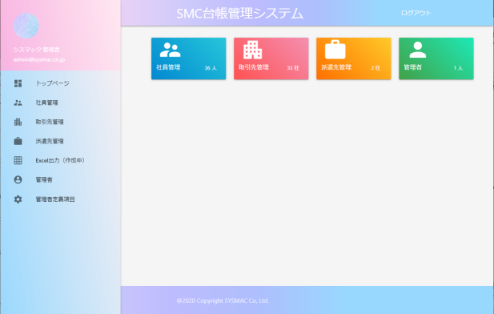

# シスマック社内台帳管理システム

## 開発環境
| 言語 | IDE | フレームワーク | CSSフレームワーク | ライブラリ管理 |
| ---- | ------- | ------------- | ------------- | ------------- |
| PHP 7.4 | Visual Studio Code | Laravel 6.0| Materialize | Composer 1.10.15 |  

## 開発環境構築の手順
0.  xampp もしくは wamp がインストールされている前提
1.	リポジトリをクローン    
    ```git clone https://github.com/Mutsumix/sample-management-system.git```
2.	Composer をインストール  
    ```composer install```
3.	.env のDB設定を自分の環境のものに変更する  
    index.php内のautoload.php, bootstrap/app のパスも確認
4.  アプリケーションキーを生成  
    ```php artisan key:generate```
5.  データベースを作成  
    ```php artisan migrate```
6.  初期データの生成
    ```php artisan db:seed```
7.  コンフィグをリセット  
    ```php artisan config:clear```
8.  データ保存フォルダをリンク  
    ```php artisan storage:link```
9.  ローカルサーバーを立ち上げる  
    ```php artisan serve```  
    http://localhost:8000/ にアクセス
10. 管理者アカウントでログイン  
    Email: admin@sysmac.co.jp  
    Password: password 

### このドキュメントについて
- 最終更新日：2021/11/12
- 更新者：梶原  

 
